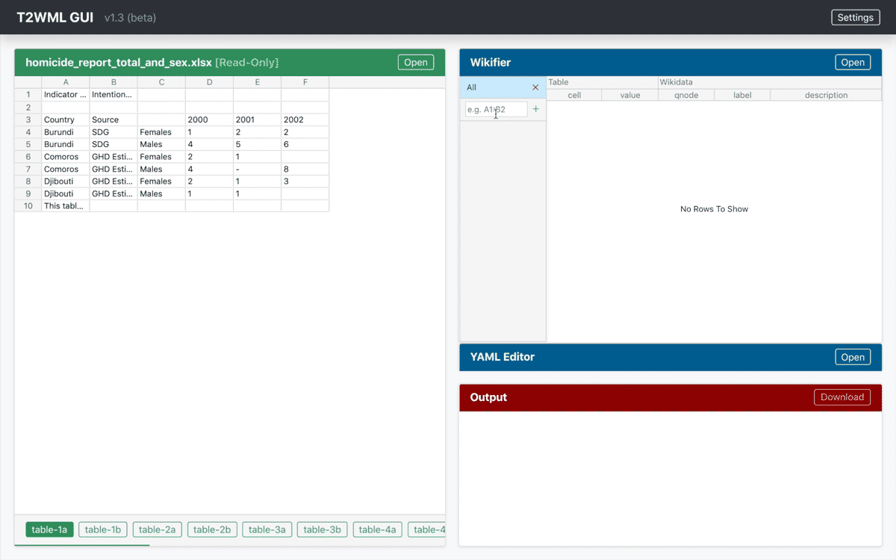
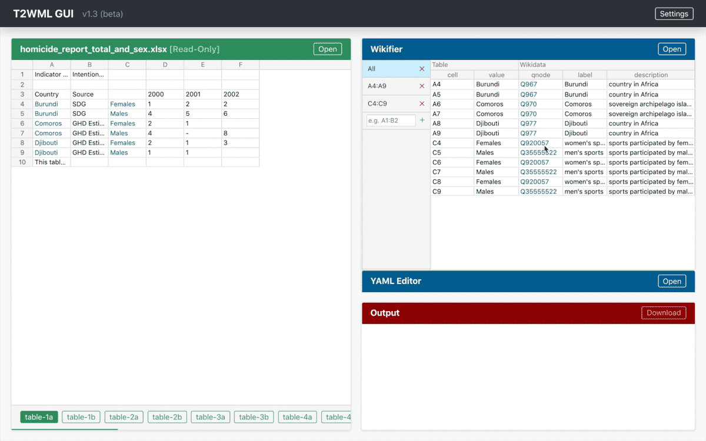
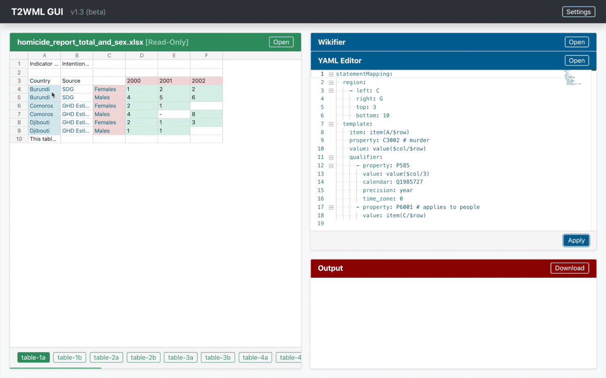

# T2WML: A Cell-Based Language To Map Tables Into Wikidata Records

[](https://coveralls.io/github/usc-isi-i2/t2wml)

* [Running T2WML for Development](#development)
* [Usage with GUI](#usage_with_gui)
* [Writing T2WML](#writing_t2wml)
* [Features](#features)
* [FAQs](#faqs)

<table>
  <tr><td><b>Operating system:</b></td><td>macOS / OS X, Linux, Windows</td></tr>
  <tr><td><b>Python version:</b></td><td>Python 3.6+</td></tr>
</table>

This is the repository for the T2WMl server-based GUI. You may be looking for the [T2WML API](https://github.com/usc-isi-i2/t2wml-api)


## Running T2WML for Development
<span id="development"></span>  

### Setting up the sources

For developing t2wml you need both the t2wml-api repository and the t2wml (this) repository.
Create a directory called `t2wml-root` and clone both repositories under it:

```
cd t2wml-root
git clone https://github.com/usc-isi-i2/t2wml-api
cd t2wml-api
git checkout development
```

```
cd t2wml-root
git clone https://github.com/usc-isi-i2/t2wml
cd t2wml
git checkout development
```

### Setting up the Electron Frontend

First you have to make sure you have Node version 12 or higher installed. Then you can run:

```
cd t2wml-root/t2wml/electron
yarn install
```

Note for developers adding package dependencies: The electron builder takes all the prod dependencies from package.json and adds them to the installation, even though webpack already takes care of everything. It is very important not to add prod dependencies, use yarn add --dev to add more packages.

### Creating the Python virtual environment

```
cd t2wml-root/t2wml/backend
python3.6 -m venv env
source env/bin/activate     # on Windows just run env/bin/activate.ps1
pip install --upgrade pip
pip install -e ../../t2wml-api   # Install t2wml-api from the cloned repository at t2wml-root/t2wml-api
pip install -r requirements.txt
```

Note: Python 3.6 and higher are supported.

### Running outside of an IDE
#### Running the backend

```
cd t2wml-root/t2wml/backend
python t2wml-server.py
```

#### Running the frontend GUI
Since we're using Electron, you need to run two scripts to run the GUI on development:

```sh
cd t2wml-root/t2wml/electron
yarn dev
```

This script compiles all the frontend files, making them ready for electron. Wait until the compilation reaches 100% (you may see some warnings, that's fine). The script will keep running, recompiling as the frontend files are updated.

Open another shell window and run 

```sh
cd t2wml-root/t2wml/electron
yarn start
```

This script starts Electron, and you should see the GUI.

Note that in development, the GUI will wait for the backend to start on port 13000, so you will need to run it.

### Using Visual Studio Code
The project has preconfigured settings file for Visual Studio Code. Before starting you need to copy the settings template appropriate for your OS.

On Macs and Linux machines, copy `.vscode/settings.linux.json` to `.vscode/settings.json` . On Windows, copy `.vscode/settings.windows.json` to `.vscode/settings.json`
Start Visual Studio Code and open it in the t2wml-root/t2wml directory.

#### GUI Development
To develop the GUI you need to run three tasks:

1. `Backend` - runs the Python backend.
2. `Build Dev GUI Continiously` - this task runs the npm `dev` script which builds the GUI and contiously watches for changes.
3. `Report GUI Coding Errors` - this tasks continuously scans the sources for errors and updates the Problems pane.
3. `Start GUI` - opens the Electron based GUI.

The GUI will not work unless the backend is up and running.

When updating the GUI code, it will be automatically rebuilt by the `Build and Watch GUI task`. You will need to reload the GUI - you can use `Reload` from the `Debug` menu.

You can also open the Chrome Developers Tools from the GUI's `Debug` menu.

#### Backend Development
To develop the backend, you need to launch the `Backend` from the debug menu. You will be able to set breakpoints and debug properly. If you want to run the GUI, start the `Build and Watch GUI` and `t2wml GUI` tasks, as well.

## Usage with GUI
<span id="usage_with_gui"></span>

1. Open the GUI
2. In **Table Viewer**,
	1. click **Upload** to open a table file (.csv/.xls/.xlsx)
3. In **Wikifier**,
	1. define and wikify the regions you need [[demo](#wikify_region)], and/or
	2. click **Upload** to open a wikifier file (.csv)
	3. correct mismatched qnode if necessary [[demo](#modify_qnode)]
4. In **YAML Editor**,
	1. type/paste in T2WML code, or
	2. click **Upload** to open a YAML file (.yaml)
	3. click **Apply** to highlight some regions in **Table Viewer**
5. In **Output**,
	1. preview result by clicking cell in **Table Viewer** [[demo](#preview_result)], or
	2. click **Download** to get all results


## Writing T2WML
<span id="writing_t2wml"></span>

Check out the [grammar guide](https://github.com/usc-isi-i2/t2wml-api/blob/master/docs/grammar.md)


## Features
<span id="features"></span>

> Note: All screenshots below are captured in GUI v1.3. Minor inconsistencies may appear.

<span id="wikify_region"></span>⬇️ Wikify region


<span id="modify_qnode"></span>⬇️ Modify qnode


<span id="preview_result"></span>⬇️ Preview result



## FAQs
<span id="faqs"></span>

* **Installation failed due to `etk`?**

    Run the following commands in terminal/cmd:
    ```
    pip uninstall etk
    pip install https://github.com/usc-isi-i2/etk/archive/development.zip
    ```

* **Login failed or encountered an authentication error like `400 (OAuth2 Error)`?**
  
    Access T2WML at `http://localhost:13000/` instead of `http://127.0.0.1:13000`.

* **Error saying can't find static/index.html?**
  
    Make sure you install t2wml-standalone in a folder that does not contain the T2WML repo or there will be a configurations clash.

* **Encountered any other error not mentioned in the FAQs?**
  
    Post the issue in the T2WML repository along with a detailed description.
